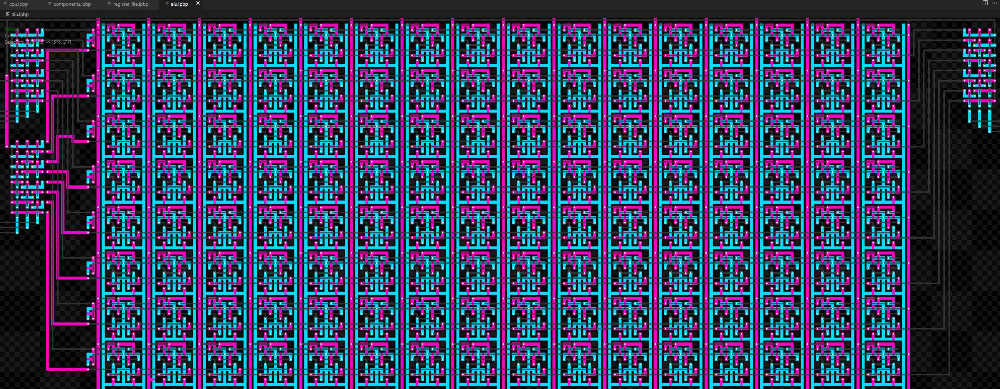

# Logic Paint

> Inspired by Zachtronic's KOHCTPYKTOP, Logic Paint allows you to edit and
> simulate transistors, at scale.

# Getting Started

Install this VSCode extension and create a file with a `.lpbp` extension. Logic
Paint uses a modal editor (like VIM). It is very powerful but does have a
learning curve. Start by placing a module (see below) and drawing some N/P type
silicon

# Standard Controls

The camera can be panned at any time (including while actively painting) by
holding down the `Space` key. It can be zoomed at any time with the scroll
wheel.

Standard controls like `Ctrl+Z` and `Ctrl+S` to undo and save should work just
fine.

## Modal Editing

Logic Paint is modal, the active mode is displayed in the upper left corner of
the editor window. It has 4 primary modes:

- `Visual` (the starting mode) lets you select, copy, paste and delete cells.
- `Silicon` paints (or removes) both N and P type silicon doping onto the
  substrate.
- `Metal` paints (or removes) a metal layer and via placements.
- `Execution` compiles logic and prepares to execute it.
- `ModuleEdit` add, remove, and edit modules (I/O to/from the substrate).
- `Label` create a text label using Silicon paint.

## Visual Mode (`ESC`)

Visual mode is accessed by clicking `ESC` from any other mode. While in visual
mode you can perform the following actions:

- **`LMB`** Create a selection with `LMB` and dragging. Clear the selection with
  `ESC` or `RMB`.
- **`Y`** Copy ("yank") the current selection into the mouse-follow buffer. Use
  `LMB` to paste the mouse-follow buffer.
- **`D`** Copy the current selection into the mouse-follow buffer _and_ delete
  the selection.
- **`Shift+D`** Delete the selection _without_ copying it into the mouse-follow
- **`S+[0-9]`** With a selection _or_ something currently in the mouse-follow
  buffer, you can hold `S` and click a number to 'store' that into a numbered
  register.
- **`[0-9]`** Once something is stored in a numbered register, you can load it
  into the mouse-follow buffer by clicking the number (without holding `S`).
- **`Shift+S+8` and `Shift+8`** Like VIM, there is a special register for
  copying/pasting into the system clipboard, the `*` register. This register
  will behave like the numbered registers, apart from the fact that it will
  always contain the system-clipboard value.
- **`R`** while the mouse-follow buffer is active to rotate it.
- **`M`** while the mouse-follow buffer is active to mirror it about the X axis.

### Visual Mouse-follow Buffer

There is a special buffer that is used for copy-paste and rotation operations,
the "mouse-follow buffer". It is filled when:

- A selection is yanked with `Y`, or deleted with `D`
- A named register is selected using `[0-9]` or `*`

While the mouse-follow buffer is active, it will show a preview of the **results
of placing the buffer onto the main blueprint**, not the contents of the buffer
itself. Meaning, the mouse-follow buffer can contain invalid connections (ie
cells that claim to connect with a neighbor who doesn't connect back) and these
broken connections will be 'stitched together' on-paste, when possible. The
mouse-buffer is ephemeral and can be cleared at any time by clicking `ESC` or
`RMB`. Additionally, clicking `R` will rotate the mouse-follow buffer 90 degrees
clockwise, and `M` will mirror it across the X axis (use `R`, `R`, `M` to mirror
about the X axis).

## Silicon Mode (`Q`)

Silicon mode is accessed with the `Q` key. It is used for painting and erasing
silicon doping. While in Silicon mode you can paint N and P type silicon, and
form gates by dragging N-type on top of a P-type trace, or vice versa.

- **`LMB`** Paint a line of N-type silicon
- **`RMB` (Or `Shift+LMB`)** Paint a line of P-type silicon
- **`Ctrl+LMB`** Erase silicon of either type

## Metal Mode (`W`)

Metal mode is accessed with the `W` key. It is used to connect Silicon together.
It lives "above" the silicon and does not touch the silicon unless you place a
via to connect them.

- **`LMB`** Paint a line of metal.
- **`RMB` (Or `Shift+LMB`)** Places a Via. Can only be used on a cell that has
  both metal and silicon and isn't a transistor.
- **`Ctrl+LMB`** Erase metal and vias.

## Execution Mode (`E`)

Execution mode is accessed with the `E` key. It used to 'simulate' the
substrate. It allows for both single-stepping as well as continuous running
modes. Right now the only run mode is one fundamental clock per frame, but more
will be added later for faster running.

- **`R`** Enters run-mode. This will execute one fundamental clock per frame.
- **`C`** Pauses run mode (if running) and executes a single fundamental clock.
- **`P`** Pauses run mode.
- **`T`** Executes a single simulation 'tick'. This is mostly for debugging
  Logic Paint itself, as ticks have very little parallel with propagation delay.

## Module Edit (`A`)

The module edit mode is used to place, remove and edit modules. These include
clocks, const values, probes and large chunks of RAM. Access the editor by
pressing `A` while in `Visual` mode. Pressing `A` again cycles through module
types that can be placed. While in Module Edit mode, you can visually see module
"roots", ie the cell where the module actually resides. Only one module can
exist per root at a time.

## Label Mode (`Enter`)

Useful tool to quickly create text labels in Silicon. Enter the label mode by
hitting `Enter`, then type your text. The text will be rendered to the mouse
follow buffer. Clicking `LMB` will place a copy of the text (without the cursor)
onto the primary buffer. Click `ESC` to exit label mode.

# Scale and Performance

There are a handful of these projects out there, of note
[PharoChipDesigner](https://github.com/pavel-krivanek/PharoChipDesigner) has a
wonderful writeup on both digital circuitry and how this type of logic differs
from real-world MOSFET/BJT/CMOS technology. Also of note is Andre's [Angular
version](https://blog.tst.sh/kohctpyktop-2-electric-bogaloo/) as well as many
more.

I wanted to build an entire CPU in this type of format (currently in-progress).
No existing project comes remotely close to the level or performance or scale I
needed for that. My ideal was fixed-cost rendering, and the ability to handle
millions of transistors. Additionally, I wanted a much more refined and
functional suite of design tools.

Logic Paint pulls that off by rendering cells exclusively in a fragment shader
(on the GPU) meaning rendering is based only on the display resolution and is
irrespective of the number of cells being drawn (modulo data transfer during
simulation). It's not an exaggeration to say that the renderer can handle
**billions** of populated cells on modern GPUs, it's limited only by your GPUs
memory, where each cell takes up 4 bytes of data. However, the culling and sync
code on my machine starts to chug at around 2 million cells. But I've done zero
optimizations on it.

The core of the application is written in Rust, and compiled to WebAssembly.
Right out of the box this gives you some immense performance wins, but more
importantly it allows for directly memory manipulation and blitting which in
tern allows for very fast designs.

## Pics or it didn't happen

This is about a half million cells, rendering at 4K and taking only 2-3ms per
frame. More cells wouldn't slow down rendering though, it would only create
sampling artifacts and a colorful view. I get to about 2 million cells before
the CPU-side of rendering calls start to chug. At 7 million cells I'm at 80ms
frames.

